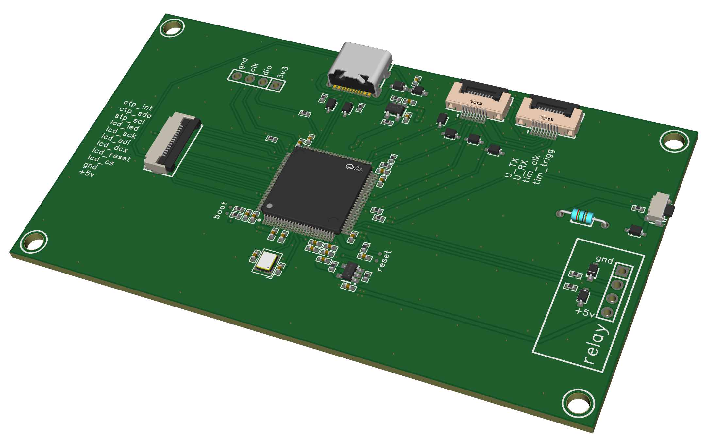

# PIANO_H7 — Controller board firmware / Прошивка платы-контроллера

[](https://doi.org/10.5281/zenodo.20569239)
[](LICENSE)
[](https://www.st.com/en/microcontrollers-microprocessors/stm32h723vg.html)

> Part of the custom optical digital MIDI piano project. Companion board:
> [**PIANO_G4_cbt6**](https://github.com/ScherbakovAl/PIANO_G4_cbt6) (sensor boards).
>
> Часть проекта самодельного цифрового MIDI-пианино на оптических датчиках.
> Парная плата: [**PIANO_G4_cbt6**](https://github.com/ScherbakovAl/PIANO_G4_cbt6) (платы-датчики).

---

## English

### Overview

**PIANO_H7** is the firmware for the **master controller board** of a self-built
digital MIDI piano that detects key strokes optically. Instead of rubber-dome
or simple contact switches, each key's hammer flies past optical sensors, and
the **hammer flight time** is measured to derive a realistic note velocity —
the same principle used in high-end digital pianos.

The instrument is split across two board types:

| Board | MCU | Role |
|-------|-----|------|
| **PIANO_H7** (this repo) | STM32H723VGTx | Master controller: UI, USB-MIDI, manages the sensor bus |
| [PIANO_G4_cbt6](https://github.com/ScherbakovAl/PIANO_G4_cbt6) | STM32G474 | Distributed sensor readers (comparators + timers) |

The boards were fabricated and assembled in late summer–autumn 2025 and are
used to play on a real instrument.

### What the H7 board does

- **Graphical UI** on an ST7796 TFT display with FT6336 capacitive touch,
  built with [LVGL](https://lvgl.io/): calibration screens, comparator
  settings, live charts of the optical sensor signals, and velocity-curve
  configuration.
- **USB-MIDI device** via [TinyUSB](https://github.com/hathach/tinyusb): the
  board enumerates as a class-compliant USB-MIDI device, so it plays into any
  DAW or host without drivers.
- **Sensor bus master:** communicates with up to 27 addressed G4 "chips"
  (addresses 1–13 for note-on sensors, 14–26 for note-off) over a multidrop
  UART (UART4), collecting hammer timings and pushing settings/calibration.
- **Velocity model:** converts hammer flight time (≈390–14000 µs) into a MIDI
  velocity using a physical model (key mass / travel distance) with separate
  ON/OFF curves.
- **Calibration storage:** comparator thresholds and calibration data are
  persisted in internal flash.
- **Bootloader / field update:** carries a custom bootloader. The H7 itself can
  be re-flashed over USB (USB DFU) using its own bootloader, and it can in turn
  flash the firmware of the G4 boards over the UART bus, including jumping
  between bootloader and main-application regions.

### Hardware

- MCU: **STM32H723VGTx**
- Display: ST7796 (TFT), touch: FT6336
- Sensor link: multidrop UART to the G4 boards
- PCB design, schematics and BOM are in [`pcb/`](pcb/) (EasyEDA Pro project,
  exported SCH/PCB PDFs and BOM).

3D render of the assembled boards, with the PCB layout and the controller-board
schematic:



- [EasyEDA Pro project (`.epro2`)](pcb/ProPrj_piano_base_v1.0_H7.epro2)
- [PCB layout ](pcb/PNG_H7/PCB_H7.png)
- [Schematic — controller / base board](pcb/PNG_H7/SCH_H7.png)

### Repository layout

```
Piano_H7/            Application firmware (piano_h7.cpp/.hpp, UI, drivers)
  ├─ st7796.*        TFT display driver
  ├─ ft6336.*        Capacitive touch driver
  ├─ lvgl/, ui/      LVGL library and generated UI
  └─ usb_descriptors USB-MIDI descriptors (TinyUSB)
Core/, Drivers/      STM32 HAL/LL, CMSIS, startup
H7_dfu_bootloader/   Custom bootloader for the H7
pcb/                 Schematics, PCB and BOM
cmake/, CMakeLists.txt, CMakePresets.json
```

### Building

The project uses CMake + the ARM GNU toolchain (configured via STM32CubeMX /
the included presets).

```bash
cmake --preset <preset>     # see CMakePresets.json
cmake --build --preset <preset>
```

Flash the resulting binary with your usual ST tool (ST-Link / DFU).

### License

Released under the [MIT License](LICENSE).

### Citation

If you use or reference this work, please cite it via its DOI (see the badge
above) or the [`CITATION.cff`](CITATION.cff) file.

---

## Русский

### Описание

**PIANO_H7** — это прошивка **главной платы-контроллера** самодельного
цифрового MIDI-пианино с оптическим считыванием нажатий. Вместо резиновых
куполов или простых контактов молоточек каждой клавиши пролетает мимо
оптических датчиков, и по **времени пролёта молоточка** вычисляется
реалистичная velocity ноты — тот же принцип, что в дорогих цифровых пиано.

Инструмент состоит из двух типов плат:

| Плата | МК | Роль |
|-------|-----|------|
| **PIANO_H7** (этот репозиторий) | STM32H723VGTx | Главный контроллер: интерфейс, USB-MIDI, управление шиной датчиков |
| [PIANO_G4_cbt6](https://github.com/ScherbakovAl/PIANO_G4_cbt6) | STM32G474 | Распределённые платы-датчики (компараторы + таймеры) |

Платы изготовлены и собраны в конце лета — осенью 2025 года и используются для
игры на реальном инструменте.

### Что делает плата H7

- **Графический интерфейс** на TFT-дисплее ST7796 с ёмкостным тачскрином
  FT6336, построенный на [LVGL](https://lvgl.io/): экраны калибровки,
  настройки компараторов, живые графики сигналов оптических датчиков,
  конфигурация кривых velocity.
- **USB-MIDI устройство** через [TinyUSB](https://github.com/hathach/tinyusb):
  плата определяется как class-compliant USB-MIDI устройство и играет в любой
  DAW/хост без драйверов.
- **Мастер шины датчиков:** обмен с до 27 адресуемыми «чипами» G4 (адреса 1–13
  — датчики note-on, 14–26 — note-off) по многоточечному UART (UART4): сбор
  таймингов молоточков, передача настроек и калибровки.
- **Модель velocity:** перевод времени пролёта молоточка (≈390–14000 мкс) в
  MIDI-velocity по физической модели (масса клавиши / расстояние) с раздельными
  кривыми ON/OFF.
- **Хранение калибровки:** пороги компараторов и данные калибровки сохраняются
  во внутренней flash-памяти.
- **Бутлоадер / обновление «в поле»:** собственный бутлоадер. Сам H7 может быть
  перепрошит по USB (USB DFU) через свой бутлоадер, а также умеет прошивать
  платы G4 по шине UART, включая переключение между областями бутлоадера и
  основного приложения.

### Аппаратная часть

- МК: **STM32H723VGTx**
- Дисплей: ST7796 (TFT), тач: FT6336
- Связь с датчиками: многоточечный UART к платам G4
- Файлы платы, схемы и BOM — в [`pcb/`](pcb/) (проект EasyEDA Pro,
  экспортированные PDF схемы/платы и BOM).

3D-вид собранных плат, трассировка платы и схема платы-контроллера:


- [Проект EasyEDA Pro (`.epro2`)](pcb/ProPrj_piano_base_v1.0_H7.epro2)
- [Трассировка платы](pcb/PNG_H7/PCB_H7.png)
- [Схема — плата-контроллер](pcb/PNG_H7/SCH_H7.png)

### Структура репозитория

```
Piano_H7/            Прошивка приложения (piano_h7.cpp/.hpp, UI, драйверы)
  ├─ st7796.*        Драйвер TFT-дисплея
  ├─ ft6336.*        Драйвер ёмкостного тача
  ├─ lvgl/, ui/      Библиотека LVGL и сгенерированный UI
  └─ usb_descriptors Дескрипторы USB-MIDI (TinyUSB)
Core/, Drivers/      STM32 HAL/LL, CMSIS, startup
H7_dfu_bootloader/   Собственный бутлоадер для H7
pcb/                 Схемы, плата и BOM
cmake/, CMakeLists.txt, CMakePresets.json
```

### Сборка

Проект использует CMake + ARM GNU toolchain (настройка через STM32CubeMX /
включённые пресеты).

```bash
cmake --preset <preset>     # см. CMakePresets.json
cmake --build --preset <preset>
```

Прошивка — обычным инструментом ST (ST-Link / DFU).

### Лицензия

Распространяется под [лицензией MIT](LICENSE).

### Цитирование

При использовании или ссылке на эту работу, пожалуйста, цитируйте по DOI
(см. бейдж выше) или через файл [`CITATION.cff`](CITATION.cff).

(для плат изготовленных лето-осень 2025)