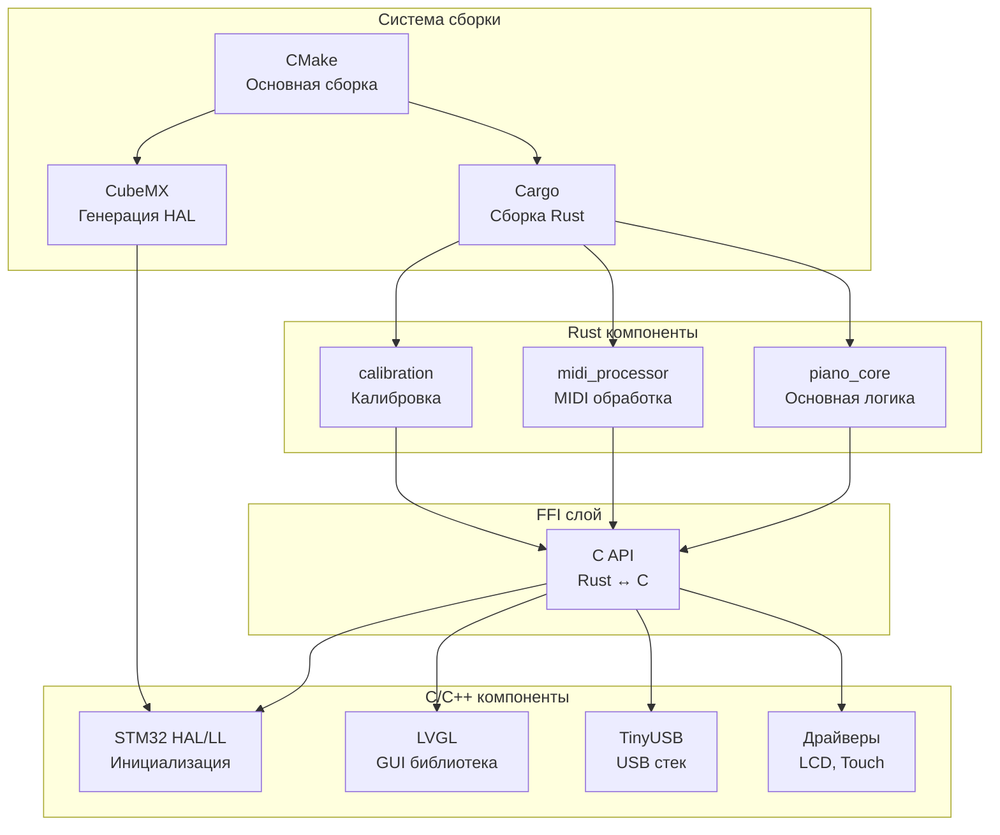

# Архитектура миграции проекта Piano_H7 на Rust

## Оглавление
1. [Анализ текущего проекта](#анализ-текущего-проекта)
2. [Рекомендуемая архитектура](#рекомендуемая-архитектура)
3. [Стратегия интеграции](#стратегия-интеграции)
4. [Структура проекта](#структура-проекта)
5. [План миграции](#план-миграции)
6. [Инструменты и библиотеки](#инструменты-и-библиотеки)
7. [Примеры кода](#примеры-кода)

---

## Анализ текущего проекта

### Текущая архитектура

Ваш проект представляет собой **MIDI-клавиатуру на STM32H723** со следующими компонентами:

#### Основные модули:
- **[`piano_h7.cpp`](Piano_H7/piano_h7.cpp)** (~1600 строк) - основная логика приложения
- **[`piano_h7.hpp`](Piano_H7/piano_h7.hpp)** - заголовочный файл с определениями
- **Драйверы дисплея**: [`st7796.cpp`](Piano_H7/st7796.cpp) (LCD)
- **Драйверы сенсора**: [`ft6336.cpp`](Piano_H7/ft6336.cpp) (Touch)
- **USB MIDI**: [`usb_descriptors.c`](Piano_H7/usb_descriptors.c)

#### Зависимости:
- **TinyUSB** - для USB MIDI коммуникации
- **LVGL** - для графического интерфейса
- **STM32 HAL/LL** - низкоуровневые драйверы
- **CubeMX** - генерация инициализации периферии

#### Ключевые функции:
1. **Обработка MIDI** - преобразование данных с датчиков в MIDI-сообщения
2. **Калибровка** - настройка чувствительности клавиш
3. **GUI** - отображение данных на LCD с LVGL
4. **Коммуникация UART** - связь с подчинёнными контроллерами G4
5. **DMA обработка** - высокоскоростной приём данных

---

## Рекомендуемая архитектура

### ⚡ **Рекомендация: CMAKE управляет Rust (гибридный подход)**

После анализа вашего проекта, я рекомендую **CMAKE в качестве основной системы сборки**, которая управляет компиляцией Rust-компонентов. Вот почему:

#### Преимущества этого подхода:

1. ✅ **Сохранение CubeMX** - вы продолжаете использовать CubeMX для генерации инициализации
2. ✅ **Постепенная миграция** - можно переносить код на Rust по частям
3. ✅ **Совместимость с LVGL** - LVGL остаётся в C, интеграция через FFI
4. ✅ **Простота отладки** - привычные инструменты (GDB, OpenOCD)
5. ✅ **Меньше изменений** - минимальные изменения в существующей инфраструктуре

#### Недостатки альтернативного подхода (Cargo управляет CMAKE):

- ❌ Сложнее интегрировать CubeMX
- ❌ Требует переписывания всей системы сборки
- ❌ Труднее для начинающих в Rust
- ❌ Проблемы с линковкой C++ библиотек

---

## Стратегия интеграции

### Архитектурная диаграмма



### Границы между Rust и C

#### Что переносим на Rust:
- ✅ **Бизнес-логика** ([`piano_h7.cpp`](Piano_H7/piano_h7.cpp:357-467) - функция `h7()`)
- ✅ **MIDI обработка** ([`piano_h7.cpp`](Piano_H7/piano_h7.cpp:655-781) - `DMA1_RX()`)
- ✅ **Калибровка** ([`piano_h7.cpp`](Piano_H7/piano_h7.cpp:281-312) - `init_buffers()`)
- ✅ **Структуры данных** ([`piano_h7.hpp`](Piano_H7/piano_h7.hpp:87-100) - `Chip`, `comparator`)
- ✅ **Алгоритмы расчёта** (скорость, энергия, velocity)

#### Что оставляем в C/C++:
- 🔵 **CubeMX генерация** - инициализация периферии
- 🔵 **LVGL** - GUI библиотека (нет Rust биндингов для embedded)
- 🔵 **TinyUSB** - USB стек (можно заменить на `usbd-midi`, но не обязательно)
- 🔵 **Драйверы LCD/Touch** - низкоуровневые драйверы

---

## Структура проекта

### Рекомендуемая структура файлов

```
PIANO_H7/
├── CMakeLists.txt              # Основная сборка
├── Piano_H7.ioc                # CubeMX конфигурация
├── STM32H723XG_FLASH.ld        # Linker script
│
├── Core/                       # CubeMX генерация (C)
│   ├── Inc/
│   └── Src/
│
├── Piano_H7/                   # C/C++ компоненты
│   ├── lvgl/                   # LVGL библиотека
│   ├── ui/                     # GUI (EEZ Studio)
│   ├── st7796.cpp              # LCD драйвер
│   ├── ft6336.cpp              # Touch драйвер
│   ├── usb_descriptors.c       # USB дескрипторы
│   └── ffi/                    # 🆕 FFI интерфейс
│       ├── piano_ffi.h         # C заголовки для Rust
│       └── piano_ffi.cpp       # C++ обёртки
│
├── piano_rust/                 # 🆕 Rust workspace
│   ├── Cargo.toml              # Workspace конфигурация
│   ├── .cargo/
│   │   └── config.toml         # Настройки компиляции
│   │
│   ├── piano_core/             # Основная логика
│   │   ├── Cargo.toml
│   │   ├── build.rs            # Build script
│   │   └── src/
│   │       ├── lib.rs
│   │       ├── state.rs        # Состояние системы
│   │       ├── chip.rs         # Работа с чипами
│   │       └── ffi.rs          # FFI экспорт
│   │
│   ├── midi_processor/         # MIDI обработка
│   │   ├── Cargo.toml
│   │   └── src/
│   │       ├── lib.rs
│   │       ├── velocity.rs     # Расчёт velocity
│   │       └── messages.rs     # MIDI сообщения
│   │
│   └── calibration/            # Калибровка
│       ├── Cargo.toml
│       └── src/
│           ├── lib.rs
│           └── buffer.rs       # Буферы калибровки
│
├── tinyusb/                    # TinyUSB (опционально)
├── Drivers/                    # STM32 HAL/LL
│
└── build/                      # Артефакты сборки
    └── rust/
        └── libpiano_core.a     # Статическая библиотека Rust
```

### Модификация CMakeLists.txt

```cmake
# Добавить в CMakeLists.txt

# ============================================
# Rust интеграция
# ============================================

set(RUST_TARGET "thumbv7em-none-eabihf")
set(RUST_WORKSPACE "${CMAKE_SOURCE_DIR}/piano_rust")
set(RUST_LIB_DIR "${CMAKE_BINARY_DIR}/rust/${CMAKE_BUILD_TYPE}")

# Определить профиль сборки
if(CMAKE_BUILD_TYPE STREQUAL "Debug")
    set(RUST_PROFILE "dev")
    set(RUST_BUILD_FLAG "")
else()
    set(RUST_PROFILE "release")
    set(RUST_BUILD_FLAG "--release")
endif()

# Команда сборки Rust
add_custom_target(rust_build
    COMMAND cargo build ${RUST_BUILD_FLAG} --target ${RUST_TARGET}
    WORKING_DIRECTORY ${RUST_WORKSPACE}
    COMMENT "Building Rust components..."
)

# Путь к библиотеке
set(RUST_LIB "${RUST_WORKSPACE}/target/${RUST_TARGET}/${RUST_PROFILE}/libpiano_core.a")

# Добавить зависимость
add_dependencies(${CMAKE_PROJECT_NAME} rust_build)

# Линковка Rust библиотеки
target_link_libraries(${CMAKE_PROJECT_NAME}
    ${RUST_LIB}
    stm32cubemx
    lvgl::lvgl
)

# Добавить FFI интерфейс
target_sources(${CMAKE_PROJECT_NAME} PRIVATE
    Piano_H7/ffi/piano_ffi.cpp
)

target_include_directories(${CMAKE_PROJECT_NAME} PRIVATE
    Piano_H7/ffi
)
```

---

## План миграции

### Этап 1: Подготовка инфраструктуры (1-2 недели)

#### Шаг 1.1: Установка Rust toolchain
```bash
# Установить rustup
curl --proto '=https' --tlsv1.2 -sSf https://sh.rustup.rs | sh

# Добавить target для STM32H7
rustup target add thumbv7em-none-eabihf

# Установить cargo-binutils
cargo install cargo-binutils
rustup component add llvm-tools-preview
```

#### Шаг 1.2: Создание Rust workspace
```bash
cd PIANO_H7
mkdir piano_rust
cd piano_rust
cargo init --lib piano_core
cargo init --lib midi_processor
cargo init --lib calibration
```

#### Шаг 1.3: Настройка `.cargo/config.toml`
```toml
[build]
target = "thumbv7em-none-eabihf"

[target.thumbv7em-none-eabihf]
rustflags = [
    "-C", "link-arg=-nostartfiles",
    "-C", "link-arg=-Wl,--no-warn-rwx-segments",
]

[unstable]
build-std = ["core", "alloc"]
build-std-features = ["panic_immediate_abort"]
```

### Этап 2: Создание FFI слоя (1 неделя)

#### Шаг 2.1: Определить C API в [`Piano_H7/ffi/piano_ffi.h`](Piano_H7/ffi/piano_ffi.h)
```c
#ifndef PIANO_FFI_H
#define PIANO_FFI_H

#include <stdint.h>
#include <stdbool.h>

#ifdef __cplusplus
extern "C" {
#endif

// Инициализация Rust компонентов
void piano_rust_init(void);

// MIDI обработка
typedef struct {
    uint8_t note;
    uint8_t velocity_hi;
    uint8_t velocity_lo;
    bool is_note_on;
} MidiMessage;

void piano_process_sensor_data(
    uint8_t sensor_id,
    uint32_t timer_value,
    MidiMessage* out_message
);

// Калибровка
void piano_set_calibration(uint8_t sensor_id, uint32_t green, uint32_t red);
void piano_get_calibration(uint8_t sensor_id, uint32_t* green, uint32_t* red);

#ifdef __cplusplus
}
#endif

#endif // PIANO_FFI_H
```

#### Шаг 2.2: Реализация FFI в Rust [`piano_rust/piano_core/src/ffi.rs`](piano_rust/piano_core/src/ffi.rs)
```rust
use core::ptr;

#[repr(C)]
pub struct MidiMessage {
    pub note: u8,
    pub velocity_hi: u8,
    pub velocity_lo: u8,
    pub is_note_on: bool,
}

#[no_mangle]
pub extern "C" fn piano_rust_init() {
    // Инициализация Rust компонентов
    crate::state::init();
}

#[no_mangle]
pub extern "C" fn piano_process_sensor_data(
    sensor_id: u8,
    timer_value: u32,
    out_message: *mut MidiMessage,
) {
    if out_message.is_null() {
        return;
    }
    
    let message = crate::midi::process_sensor(sensor_id, timer_value);
    
    unsafe {
        ptr::write(out_message, message);
    }
}
```

### Этап 3: Миграция компонентов (2-4 недели)

#### Приоритет миграции:

1. **Структуры данных** ([`piano_h7.hpp`](Piano_H7/piano_h7.hpp:87-100))
   - `Chip`, `comparator` → Rust structs
   - Безопасная работа с памятью

2. **MIDI процессор** ([`piano_h7.cpp`](Piano_H7/piano_h7.cpp:655-781))
   - Расчёт velocity
   - Формирование MIDI сообщений
   - Критичная производительность

3. **Калибровка** ([`piano_h7.cpp`](Piano_H7/piano_h7.cpp:281-312))
   - Управление буферами
   - Сохранение/загрузка из Flash

4. **Основной цикл** ([`piano_h7.cpp`](Piano_H7/piano_h7.cpp:357-467))
   - State machine
   - Координация компонентов

### Этап 4: Тестирование и оптимизация (1-2 недели)

- Юнит-тесты для Rust компонентов
- Интеграционные тесты
- Профилирование производительности
- Оптимизация размера бинарника

---

## Инструменты и библиотеки

### Обязательные Rust crates

#### [`piano_rust/piano_core/Cargo.toml`](piano_rust/piano_core/Cargo.toml)
```toml
[package]
name = "piano_core"
version = "0.1.0"
edition = "2021"

[dependencies]
# Embedded HAL
cortex-m = "0.7"
cortex-m-rt = "0.7"

# Утилиты
heapless = "0.8"          # Коллекции без аллокатора
nb = "1.1"                # Non-blocking операции
embedded-hal = "1.0"      # HAL traits

# Опционально: MIDI
# usbd-midi = "0.2"       # Если заменяем TinyUSB

[profile.release]
opt-level = "z"           # Оптимизация размера
lto = true                # Link-time optimization
codegen-units = 1         # Лучшая оптимизация
panic = "abort"           # Меньше размер
strip = true              # Удалить отладочные символы
```

### Альтернативы TinyUSB

#### Вариант 1: Оставить TinyUSB (рекомендуется для начала)
- ✅ Уже работает
- ✅ Проверенное решение
- ✅ Меньше изменений
- ❌ Остаётся C код

#### Вариант 2: Использовать `usbd-midi` (для будущего)
```toml
[dependencies]
usbd-midi = "0.2"
usb-device = "0.3"
stm32h7xx-hal = { version = "0.16", features = ["stm32h723", "usb_hs"] }
```

**Рекомендация**: Начните с TinyUSB, позже можете мигрировать на `usbd-midi`.

### LVGL интеграция

LVGL остаётся в C, взаимодействие через FFI:

```rust
// Rust вызывает LVGL функции
extern "C" {
    fn lv_chart_refresh(chart: *mut c_void);
    fn lv_label_set_text(label: *mut c_void, text: *const c_char);
}

pub fn update_chart(chart: *mut c_void) {
    unsafe {
        lv_chart_refresh(chart);
    }
}
```

---

## Примеры кода

### Пример 1: Структура Chip в Rust

**Было (C++)**: [`piano_h7.hpp`](Piano_H7/piano_h7.hpp:95-100)
```cpp
struct Chip {
    uint8_t number_chip = 0;
    std::vector<comparator> comparators;
    typeAction typ = typeAction::none;
    chip_states st = chip_states::none;
};
```

**Стало (Rust)**:
```rust
use heapless::Vec;

#[derive(Debug, Clone, Copy)]
#[repr(u8)]
pub enum TypeAction {
    On = 1,
    Off = 2,
    None = 0,
}

#[derive(Debug, Clone, Copy)]
#[repr(u8)]
pub enum ChipState {
    Boot = 1,
    Main = 2,
    None = 0,
}

#[derive(Debug, Clone, Copy)]
pub struct Comparator {
    pub cursor: u8,
    pub address: u8,
    pub number_chip: u8,
    pub number_comparator: u8,
    pub is_active: bool,
}

pub struct Chip {
    pub number_chip: u8,
    pub comparators: Vec<Comparator, 7>, // heapless::Vec, размер известен
    pub typ: TypeAction,
    pub state: ChipState,
}

impl Chip {
    pub fn new(number: u8, typ: TypeAction) -> Self {
        Self {
            number_chip: number,
            comparators: Vec::new(),
            typ,
            state: ChipState::None,
        }
    }
}
```

### Пример 2: MIDI обработка

**Было (C++)**: [`piano_h7.cpp`](Piano_H7/piano_h7.cpp:712-737)
```cpp
speed_F = distance_2 / (tOut + aX);
energy_F = (key_mass_2 * speed_F * speed_F) / 2.0f;
midi_hi_F = energy_F;
midi_lo_F = modf(midi_hi_F, &integerPart_F) * maxMidi_F;

if (midi_hi_F < 1) {
    midi_hi_F = 1;
    midi_lo_F = 1;
}

if (midi_hi_F > 127) {
    midi_hi_F = 127;
    midi_lo_F = 127;
}

uint8_t note_buf[] = {
    0xB0,
    0x58,
    (uint8_t)midi_lo_F,
    (uint8_t)rxB < 98U ? 0x90U : 0x80U,
    note_,
    (uint8_t)midi_hi_F
};
```

**Стало (Rust)**:
```rust
pub struct VelocityCalculator {
    distance: f32,
    key_mass: f32,
    ax: f32,
    max_midi: f32,
}

impl VelocityCalculator {
    pub const fn new() -> Self {
        Self {
            distance: 17000.0,
            key_mass: 819.79,
            ax: 24568.0,
            max_midi: 127.99,
        }
    }
    
    pub fn calculate(&self, timer_value: u32) -> (u8, u8) {
        let speed = self.distance / (timer_value as f32 + self.ax);
        let energy = (self.key_mass * speed * speed) / 2.0;
        
        let mut midi_hi = energy;
        let midi_lo = (midi_hi.fract() * self.max_midi) as u8;
        
        // Ограничение диапазона
        midi_hi = midi_hi.clamp(1.0, 127.0);
        
        (midi_hi as u8, midi_lo)
    }
}

#[repr(C)]
pub struct MidiNoteMessage {
    pub control_change: [u8; 3],  // 0xB0, 0x58, velocity_lo
    pub note_event: [u8; 3],      // status, note, velocity_hi
}

impl MidiNoteMessage {
    pub fn new(note: u8, velocity_hi: u8, velocity_lo: u8, is_note_on: bool) -> Self {
        let status = if is_note_on { 0x90 } else { 0x80 };
        
        Self {
            control_change: [0xB0, 0x58, velocity_lo],
            note_event: [status, note, velocity_hi],
        }
    }
    
    pub fn as_bytes(&self) -> &[u8; 6] {
        unsafe { core::mem::transmute(self) }
    }
}
```

### Пример 3: Калибровка с Flash

**Было (C++)**: [`piano_h7.cpp`](Piano_H7/piano_h7.cpp:845-904)
```cpp
void save_to_memory() {
    SCB_DisableICache();
    SCB_DisableDCache();
    HAL_FLASH_Unlock();
    
    FLASH_Erase_Sector(FLASH_SECTOR_7, FLASH_BANK_1, FLASH_VOLTAGE_RANGE_2);
    
    uint32_t Addr = ADDRESS_H7_CALIB;
    for (uint32_t i = 0; i < size_BUFFER; i += 8) {
        if (HAL_FLASH_Program(FLASH_TYPEPROGRAM_FLASHWORD, Addr, 
                              (uint32_t)&buffer_green[i]) != HAL_OK) {
            // error handling
        }
        Addr += 0x20;
    }
    // ...
}
```

**Стало (Rust)**:
```rust
use core::ptr;

const FLASH_SECTOR_7: u32 = 0x080E0000;
const BUFFER_SIZE: usize = 200;

pub struct CalibrationData {
    pub green: [u32; BUFFER_SIZE],
    pub red: [u32; BUFFER_SIZE],
}

impl CalibrationData {
    pub fn save_to_flash(&self) -> Result<(), FlashError> {
        // Вызов HAL функций через FFI
        unsafe {
            hal_flash_unlock();
            hal_flash_erase_sector(7)?;
            
            let mut addr = FLASH_SECTOR_7;
            
            // Сохранение green буфера
            for chunk in self.green.chunks(8) {
                hal_flash_program(addr, chunk.as_ptr())?;
                addr += 0x20;
            }
            
            // Сохранение red буфера
            for chunk in self.red.chunks(8) {
                hal_flash_program(addr, chunk.as_ptr())?;
                addr += 0x20;
            }
            
            hal_flash_lock();
        }
        
        Ok(())
    }
    
    pub fn load_from_flash() -> Self {
        let mut data = Self {
            green: [0; BUFFER_SIZE],
            red: [0; BUFFER_SIZE],
        };
        
        unsafe {
            let flash_ptr = FLASH_SECTOR_7 as *const u32;
            
            for i in 0..BUFFER_SIZE {
                data.green[i] = ptr::read_volatile(flash_ptr.add(i));
            }
            
            let offset = (BUFFER_SIZE / 8) * 8; // Выравнивание
            for i in 0..BUFFER_SIZE {
                data.red[i] = ptr::read_volatile(flash_ptr.add(offset + i));
            }
        }
        
        data
    }
}

// FFI объявления для HAL функций
extern "C" {
    fn hal_flash_unlock();
    fn hal_flash_lock();
    fn hal_flash_erase_sector(sector: u8) -> i32;
    fn hal_flash_program(addr: u32, data: *const u32) -> i32;
}

#[derive(Debug)]
pub enum FlashError {
    EraseError,
    ProgramError,
}
```

---

## Рекомендации по реализации

### 1. Начните с малого

**Первый шаг**: Создайте простой Rust модуль, который экспортирует одну функцию:

```rust
// piano_rust/piano_core/src/lib.rs
#![no_std]

#[no_mangle]
pub extern "C" fn rust_hello() -> u32 {
    42
}
```

Вызовите её из C++:
```cpp
extern "C" uint32_t rust_hello();

void test_rust() {
    uint32_t result = rust_hello();
    // result == 42
}
```

### 2. Используйте `#[repr(C)]` для всех FFI структур

```rust
#[repr(C)]
pub struct MyStruct {
    pub field1: u32,
    pub field2: u8,
}
```

### 3. Обрабатывайте ошибки безопасно

```rust
#[no_mangle]
pub extern "C" fn safe_function(ptr: *const u8) -> i32 {
    if ptr.is_null() {
        return -1; // Код ошибки
    }
    
    // Безопасная обработка
    0 // Успех
}
```

### 4. Используйте `heapless` вместо `std::vector`

```rust
use heapless::Vec;

let mut vec: Vec<u32, 10> = Vec::new(); // Максимум 10 элементов
vec.push(42).ok();
```

### 5. Профилируйте размер бинарника

```bash
cargo bloat --release --target thumbv7em-none-eabihf
```

---

## Сравнение подходов

### Вариант A: CMAKE управляет Rust ⭐ (Рекомендуется)

```
┌─────────────────────────────────────┐
│          CMakeLists.txt             │
│  (Основная система сборки)          │
└──────────┬──────────────────────────┘
           │
           ├──> CubeMX (генерация HAL)
           ├──> Cargo (сборка Rust)
           ├──> LVGL (C библиотека)
           └──> TinyUSB (C библиотека)
                    │
                    ▼
           ┌─────────────────┐
           │  Piano_H7.elf   │
           └─────────────────┘
```

**Плюсы**:
- ✅ Минимальные изменения
- ✅ Сохранение CubeMX workflow
- ✅ Простая интеграция
- ✅ Привычные инструменты

**Минусы**:
- ⚠️ Нужно вручную управлять зависимостями Rust
- ⚠️ Сложнее использовать Cargo features

### Вариант B: Cargo управляет CMAKE

```
┌─────────────────────────────────────┐
│           Cargo.toml                │
│  (Основная система сборки)          │
└──────────┬──────────────────────────┘
           │
           ├──> build.rs (вызывает CMake)
           │         │
           │         └──> CubeMX
           │         └──> LVGL
           │         └──> TinyUSB
           │
           └──> Rust crates
                    │
                    ▼
           ┌─────────────────┐
           │  Piano_H7.elf   │
           └─────────────────┘
```

**Плюсы**:
- ✅ Нативная Rust экосистема
- ✅ Cargo features и зависимости
- ✅ Лучше для чистого Rust проекта

**Минусы**:
- ❌ Сложная интеграция CubeMX
- ❌ Требует переписывания сборки
- ❌ Труднее для начинающих
- ❌ Проблемы с C++ библиотеками

---

## Заключение и следующие шаги

### Итоговая рекомендация

Для вашего проекта я рекомендую **гибридный подход с CMAKE в качестве основы**:

1. **Сохраните** CubeMX для инициализации периферии
2. **Оставьте** LVGL и TinyUSB в C (пока)
3. **Перенесите** бизнес-логику на Rust постепенно
4. **Используйте** FFI для взаимодействия между языками

### Дорожная карта

#### Фаза 1: Proof of Concept (1-2 недели)
- [ ] Установить Rust toolchain
- [ ] Создать минимальный Rust модуль
- [ ] Интегрировать с CMake
- [ ] Вызвать Rust функцию из C++

#### Фаза 2: FFI инфраструктура (1 неделя)
- [ ] Создать FFI слой
- [ ] Определить C API
- [ ] Реализовать базовые функции

#### Фаза 3: Миграция компонентов (2-4 недели)
- [ ] Перенести структуры данных
- [ ] Перенести MIDI процессор
- [ ] Перенести калибровку
- [ ] Перенести основной цикл

#### Фаза 4: Оптимизация (1-2 недели)
- [ ] Профилирование
- [ ] Оптимизация размера
- [ ] Тестирование
- [ ] Документация

### Полезные ресурсы

- **Embedded Rust Book**: https://docs.rust-embedded.org/book/
- **STM32H7 HAL**: https://github.com/stm32-rs/stm32h7xx-hal
- **Cortex-M Quickstart**: https://github.com/rust-embedded/cortex-m-quickstart
- **FFI Guide**: https://doc.rust-lang.org/nomicon/ffi.html
- **Heapless**: https://docs.rs/heapless/

### Вопросы для обсуждения

1. Хотите ли вы начать с простого proof-of-concept?
2. Какой компонент хотите перенести первым?
3. Нужна ли помощь с настройкой инфраструктуры?
4. Планируете ли в будущем полностью отказаться от C++?

---

**Автор**: Kilo Code (Architect Mode)  
**Дата**: 2026-02-10  
**Версия**: 1.0
